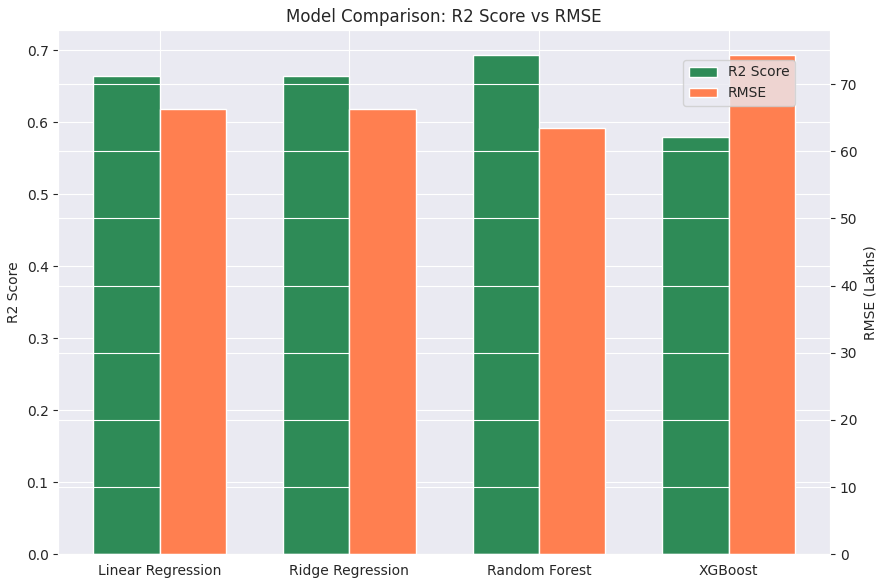
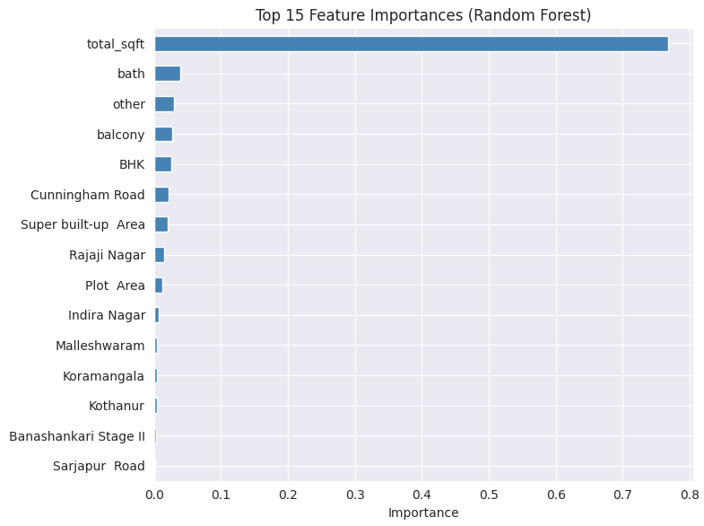
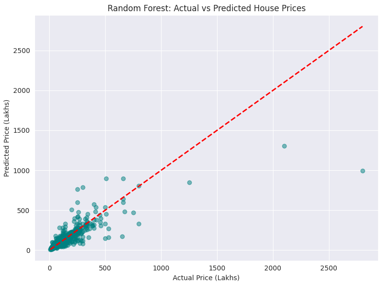

# Bengaluru House Price Prediction

Regression project predicting residential property prices in Bengaluru using real-world listing data, with a focus on rigorous data cleaning and honest model comparison.

## Dataset

- Source: Bengaluru House Data (13,320 listings, 9 original features)
- Features: area type, location, size (BHK), total square footage, bathrooms, balconies, price (in Lakhs INR)

## Data Cleaning & Feature Engineering

Real-world listing data required substantial cleaning before modeling:

- Dropped `society` (41% missing, too sparse to encode) and `availability` (weak price signal)
- Extracted numeric `BHK` from mixed `size` values ("2 BHK", "4 Bedroom", "1 RK")
- Converted `total_sqft` from mixed formats — ranges ("2100 - 2850"), Sq. Meter, and Perch — into a single numeric column; dropped 28 rows using rare units (Sq. Yards, Acres, Cents, Guntha, Grounds)
- Filled missing `bath` values using BHK-grouped median; filled `balcony` with overall median
- Removed unrealistic BHK-to-sqft ratios (< 300 sqft per BHK)
- Removed price-per-sqft outliers within each location group (mean ± 1 std)
- Removed properties with bathroom count exceeding BHK + 2 (data errors)
- Grouped 582 rare locations (≤10 occurrences) into a single "other" category to control dimensionality
- One-hot encoded `location` and `area_type`

Final dataset: 9,321 rows × 187 features (down from 13,320 rows × 9 raw columns).

## Models Compared

| Model | R² Score | MAE (Lakhs) | RMSE (Lakhs) |
|---|---|---|---|
| Linear Regression | 0.6646 | 24.21 | 66.32 |
| Ridge Regression | 0.6647 | 24.11 | 66.30 |
| **Random Forest** | **0.6929** | **21.19** | **63.45** |
| XGBoost (tuned) | 0.5789 | 22.75 | 74.30 |

**Random Forest performed best.** Notably, XGBoost underperformed both linear models here — a genuine finding rather than a tuning failure. With 187 mostly sparse one-hot encoded location features, XGBoost's greedy tree splits overfit to noise more readily than Random Forest's bagged, decorrelated trees. This highlights that gradient boosting isn't universally superior — feature structure matters as much as model choice.

## Feature Importance (Random Forest)

`total_sqft` dominates prediction (77% importance), followed by `bath`, `BHK`, `balcony`, and a handful of premium locations (Cunningham Road, Rajaji Nagar, Indira Nagar).

## Model Limitations

The actual-vs-predicted plot shows strong performance for properties under ₹500 Lakhs, but degraded accuracy for ultra-luxury properties (₹2000+ Lakhs) — a direct result of their scarcity in the training data rather than a modeling flaw.

## Tech Stack

Python, pandas, NumPy, scikit-learn, XGBoost, Matplotlib, Seaborn, Google Colab

## Files

- `Bengaluru_House_Data.csv` — raw dataset
- `house_price_prediction.ipynb` — full notebook (EDA, cleaning, modeling, evaluation)
- `actual_vs_predicted.png`, `feature_importance.png`, `model_comparison.png` — visualizations

  
## Author

**Shibila Sherin M**

Data Science | Data Analysis | Power BI | Python |Statistics | Machine Learning | NLP | Deep Learning | SQL

